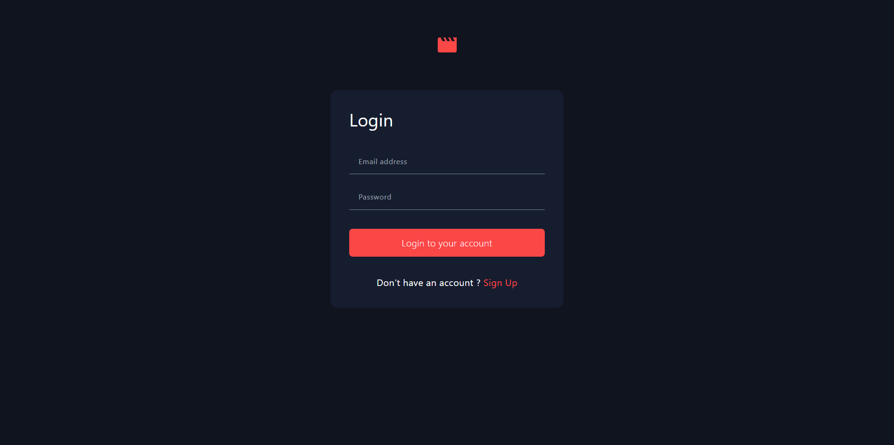
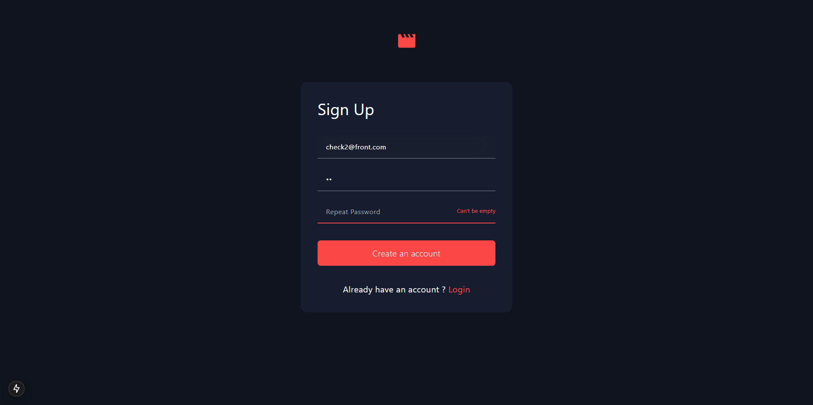
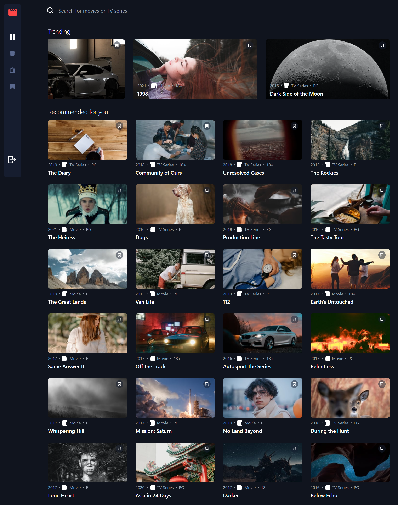
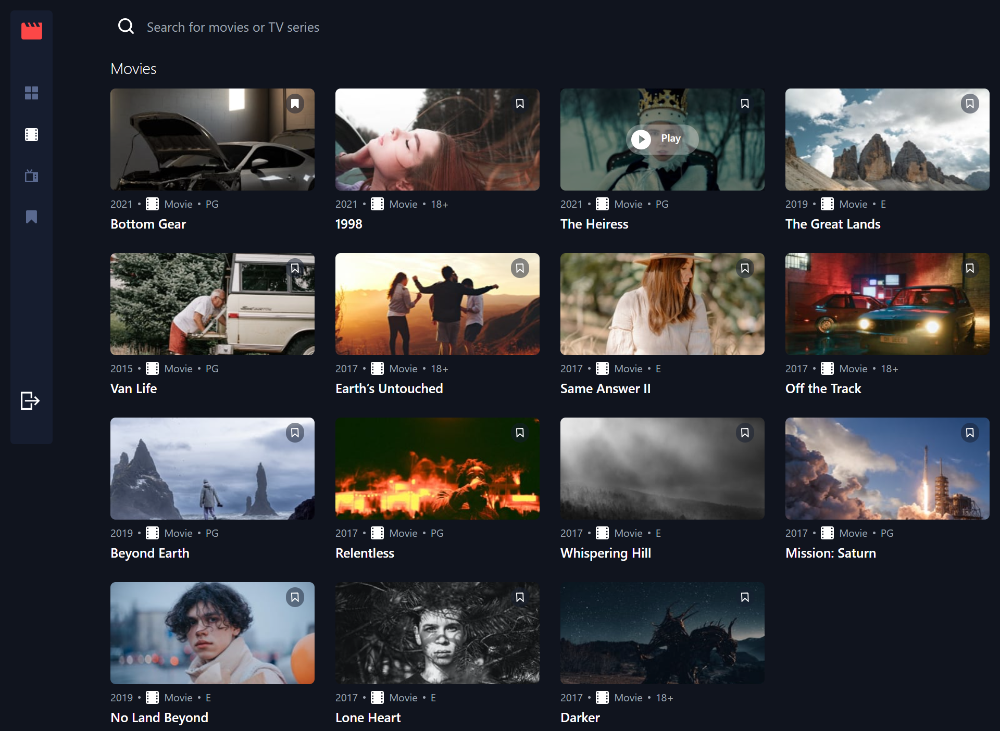
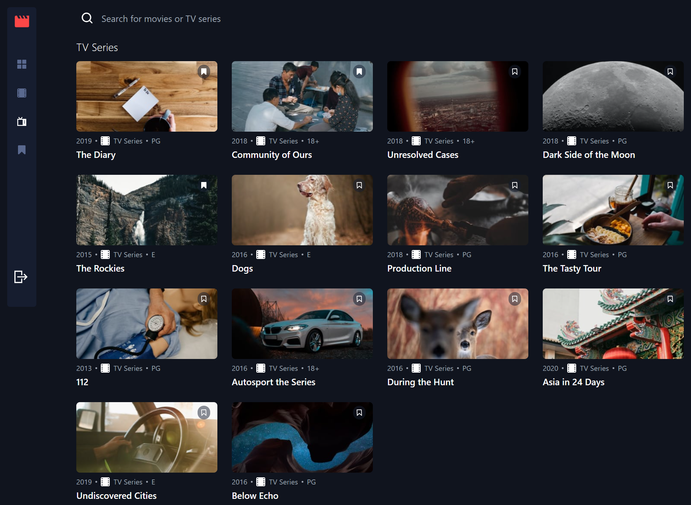
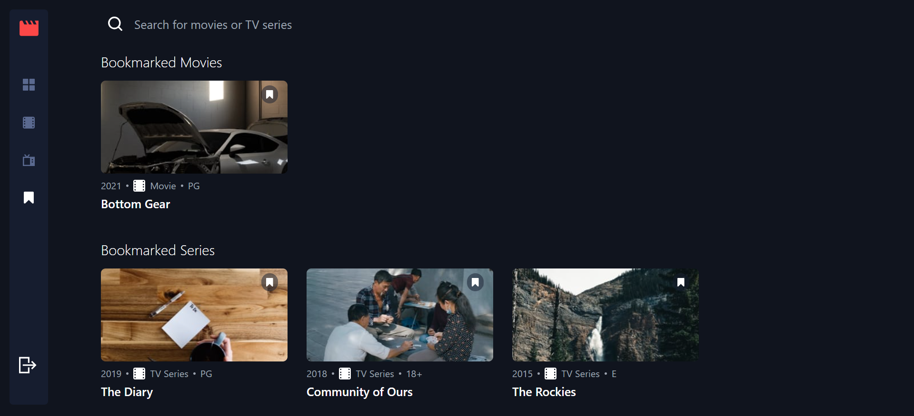
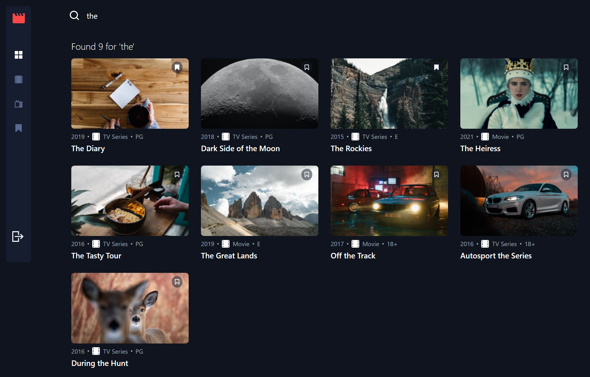

# Frontend Mentor - Contact form solution

This is a solution to the [Contact form challenge on Frontend Mentor](https://www.frontendmentor.io/challenges/contact-form--G-hYlqKJj). Frontend Mentor challenges help you improve your coding skills by building realistic projects.

**Login and password in useful ressources section**

## Table of contents

- [Overview](#overview)
  - [The challenge](#the-challenge)
  - [Screenshot](#screenshot)
  - [Links](#links)
- [My process](#my-process)
  - [Built with](#built-with)
  - [What I learned](#what-i-learned)
  - [Continued development](#continued-development)
  - [Useful resources](#useful-resources)
- [Author](#author)

## Overview

### The challenge

Your users should be able to:

- View the optimal layout for the app depending on their device's screen size
- See hover states for all interactive elements on the page
- Navigate between Home, Movies, TV Series, and Bookmarked Shows pages
- Add/Remove bookmarks from all movies and TV series
- Search for relevant shows on all pages
- **Bonus**: Build this project as a full-stack application
- **Bonus**: If you're building a full-stack app, we provide authentication screen (sign-up/login) designs if you'd like to create an auth flow

### Expected Behaviour

- General
  - The navigation menu should be fixed to the left for larger screens. Use the "Desktop - Home" page in the design as a visual reference.
- Home
  - The trending section should scroll sideways to reveal other trending shows
  - Any search input should search through all shows (i.e. all movies and TV series)
- Movies
  - This page should only display shows with the "Movie" category
  - Any search input should search through all movies
- TV Series
  - This page should only display shows with the "TV Series" category
  - Any search input should search through all TV series
- Bookmarked Shows
  - This page should display all bookmarked shows from both categories
  - Any search input should search through all bookmarked shows

### Screenshot

### Links

- Solution URL: [Github](https://github.com/donado10/entertainment-web-app)
- Live Site URL: [Live site](entertainment-web-app-sigma-ten.vercel.app)

## My process

### Built with

- Semantic HTML5 markup
- Mobile-first workflow
- [NextJS](https://nextjs.org/) - JS library
- [Typescript](https://www.typescriptlang.org/) - JS with syntax for types.
- [Tailwind](https://tailwindcss.com/) - A utility-first CSS framework

**Note: These are just examples. Delete this note and replace the list above with your own choices**

### What I learned

How to really use Next JS as a fullstack project

### Continued development

Learn page transition for future project

### Useful resources

-login:

- check1@front.com (mdp:check1)
- check2@front.com (mdp:check2)

## Author

- Frontend Mentor - [@donado10](https://www.frontendmentor.io/profile/donado10)
- Twitter - [@hey\_\_ado](https://x.com/Hey__Ado)
